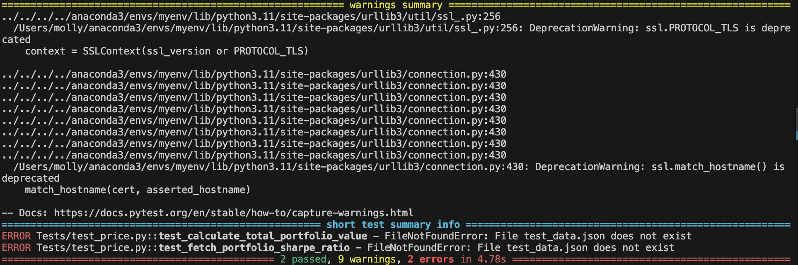
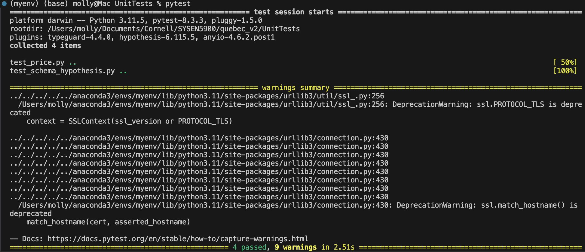

This is a walk through of the steps taken to structure code as python packages. I also reorganized some files, added a Schemas directory and a UnitTests directory.

1. Make Pricing Application directory.
```
mkdir PriceApp
```

2. To be a package, the directory needs to have an init.py file
```
touch __init__.py
```

3. Move price.py into this directory
```
mv price.py 
```

4. Create UnitTests directory
```
mkdir UnitTests
```

5. Move pricetest.py and test_data.json into the UnitTests directory
```
mv pricetest.py UnitTests/
mv test_data.json mv test_data.json UnitTests/
```

6. Modify pricetest.py to import from price.py from PriceApp.

```
#changed:
from price import fetch_portfolio_sharpe_ratio, load_portfolio, calculate_total_portfolio_value

#to:
from PriceApp.price import fetch_portfolio_sharpe_ratio, load_portfolio, calculate_total_portfolio_value
```

7. Make JSON_Validation a package
```
cd JSON_Validation
touch __init__.py
```

8. Creating a schemas directory
```
mkdir Schemas
```

9. Moving stock-schema.json into Schemas directory.
```
mv stock-schema.json Schemas/
```

10. Modifying load_schema function in validator.py to make sure i'm accessing stock-schema.json from Schemas directory.
```
def load_schema(json_schema):

# Get the current directory where the script is located (validator.py)

script_dir = os.path.dirname(__file__)

file_path = os.path.join(script_dir, '..', 'Schemas', json_schema) # Move up one level and then to 'schemas'

print(f"Loading schema from: {file_path}")

with open(file_path, 'r') as stock_schema:

schema = json.load(stock_schema)

# Used for debugging (optional)

#print("Loaded Schema:")

#print(json.dumps(schema, indent=2))

return schema
```

11. Modify test_stock_hypothesis.py to import load_schema from validator.py
```
from JSON_Validation.validator import load_schema

schema = load_schema('stock-schema.json')
```

12. Move test_stock_hypothesis.py to UnitTests directory
```
mv test_stock_hypothesis.py ../UnitTests/
```

13. Renamed test_stock_hypothesis.py to test_schema_hypothesis.py because it is more appropriate.
    
14. Renamed pricetest.py to test_price.py to get it captured by pytest.

15. Ran pytest from root directory.
```
pytest
```

16. Pytest couldnt find PriceApp or JSON_Validation


17. Creating a conftest.py in the UnitTests directory file to modify the Python module search path (sys.path) so that pytest can find PriceApp and JSON_Validation

```
import sys
import os

#adding the project root directory to sys.path so python can find PriceApp and JSON_Validation

sys.path.insert(0, os.path.abspath(os.path.join(os.path.dirname(__file__), '..')))
```

18. Running pytest from UnitTests/ directory
```
pytest
```

19. Success!!
